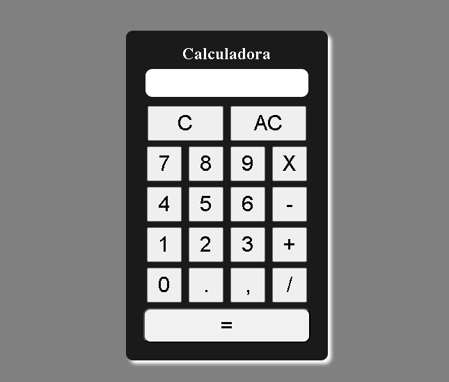

# Projeto Calculadora JS

[]

## Descrição

 Uma calculadora simples em JavaScript é um projeto comum para aprender a interagir com elementos HTML e realizar operações matemáticas básicas.

 Multiplicação (x);

 Subtração (-);

 Adiçaõ (+);

 Divição (/);

 Resultado (=);

 Botão 'C' para apagar um número por vez;

 Botão 'AC' para recomeçar.

 ## Tecnologias Usadas:

 - HTML;

 - CSS;

 - JavaScript.